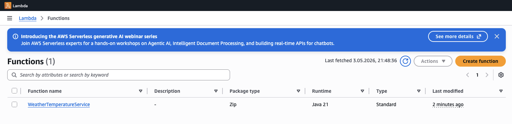
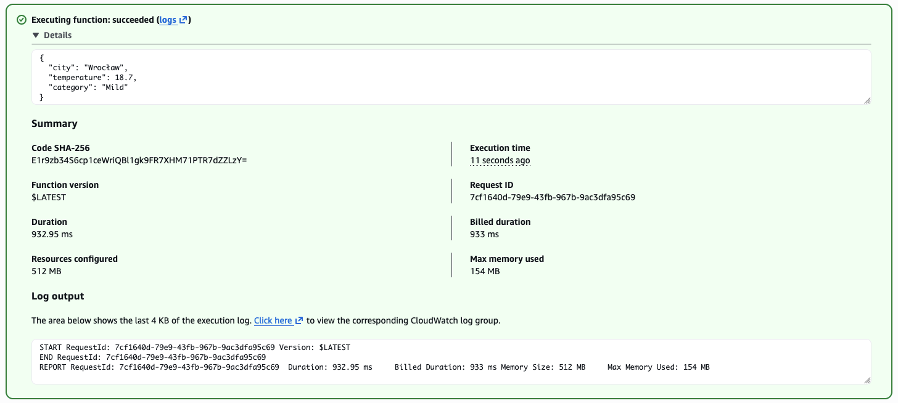
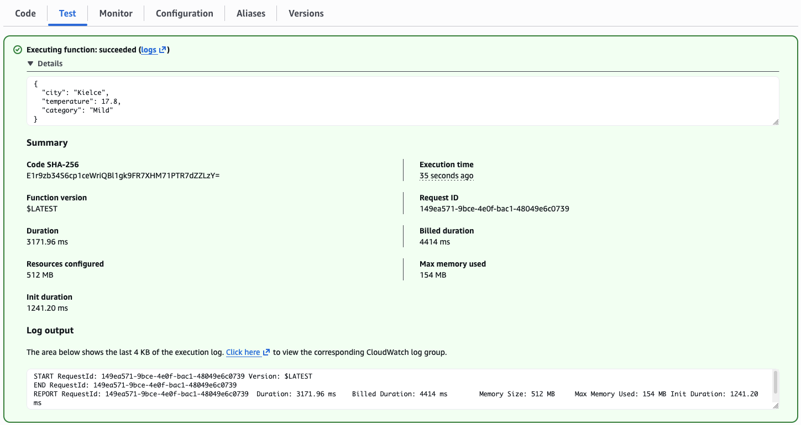
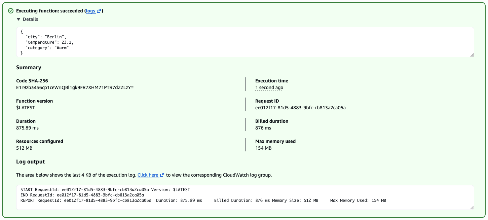
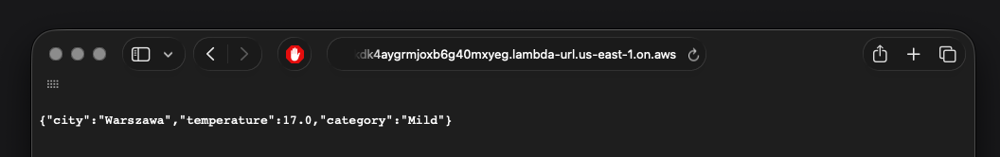
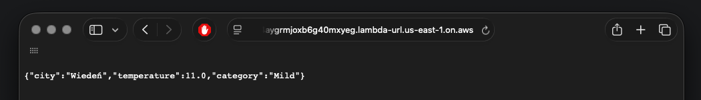

# Weather Temperature Service (AWS Lambda)

## 1. Solution Description
My implementation uses **Hexagonal Architecture** (Ports and Adapters) to separate business logic from AWS infrastructure and external APIs. The solution consists of a core domain for temperature categorization, an outbound adapter for **Open-Meteo API**, and two specialized inbound Lambda handlers.
## 2. Key Design Decisions
*   **Hexagonal Architecture**: Used to ensure the core logic is independent of external providers.
*   **Separation of Concerns**: Classification logic is isolated in the domain layer; handlers only orchestrate the flow.
*   **Specialized Handlers**:
    *   `Task2LambdaHandler`: For direct console/typed input.
    *   `Task3LambdaHandler`: For AWS Function URL (handles HTTP proxy events and query params).
*   **Automatic Serialization**: Handlers return POJO objects (Records), which AWS Lambda automatically serializes to JSON.
*   **Port-Adapter Decoupling**: Interface-based design allows swapping weather providers without touching business logic.
## 3. Unit Testing Strategy
The code is designed for testing without real API calls or AWS deployment:
*   **Mocking**: Using **Mockito** library to mock the `WeatherProviderPort` and simulate various temperatures.
*   **Domain Tests**: The `TemperatureCategory` enum and `WeatherService` can be tested in isolation to verify classification ranges.
## 4. Task 3: Endpoint Information
*   **Publicly Accessible URL**: `https://cdpshco5bikdk4aygrmjoxb6g40mxyeg.lambda-url.us-east-1.on.aws`
*   **GET Parameter**: `city`
*   **Example Request**: `https://cdpshco5bikdk4aygrmjoxb6g40mxyeg.lambda-url.us-east-1.on.aws/?city=Wroclaw`

## 5. Design Reflection (Task 4)
The use of **Hexagonal Architecture** allows adding new providers by simply creating a new adapter class. The core domain remains untouched.

**What I would improve (Future Improvements):**

*   Dependency Injection: I would introduce a DI framework to manage object creation automatically, instead of instantiating everything manually in the handlers.
*   Better Error Handling: I'd add a clean way to return consistent JSON error messages and proper HTTP status codes (like 400 or 404) so the API is easier to use.

## 6. Screenshots
You can find all required screenshots in the `doc/` directory:
### Task 1: Basic Implementation
*   **Lambda creation**: 

*   **Execution result**: 
### Task 2: City Parameter Extension
*   **Test City 1 - Kielce**:
*   **Test City 2 - Berlin**: 
### FUNCTION URL
*   **Function URL City 1 - Warszawa**: 
*   **Function URL 2 - Wiedeń**: 
